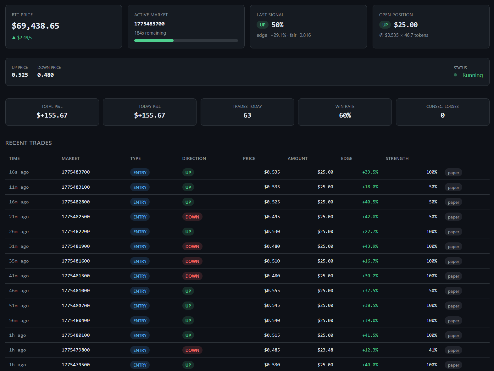

<div align="center">


# btcbot

Latency-arbitrage trading bot for [Polymarket](https://polymarket.com)'s 5-minute BTC binary markets, with a real-time web dashboard.

[](https://www.python.org)
[](LICENSE)
[](https://fastapi.tiangolo.com)

[Overview](#overview) · [Quick Start](#quick-start) · [Dashboard](#dashboard) · [Configuration](#configuration) · [Architecture](#architecture)

</div>

---

**The edge**: BTC prices on Binance update in ~100ms. Polymarket odds and the Chainlink oracle lag behind. The bot detects these divergences and bets on the correct direction before the market catches up.

Inspired by **stargate5** — [$168K profit from 16,816 trades at 61.5% win rate](#about-stargate5) on these exact markets.

> [!CAUTION]
> This bot is for **educational and research purposes**. Trading on prediction markets involves real financial risk. The strategy has a ~60% expected win rate — meaning ~40% of trades lose. Always start with paper trading.

## Overview

Polymarket offers rolling 5-minute windows where you bet whether BTC will finish **higher** ("Up") or **lower** ("Down") than its starting price. Each outcome trades as a token priced $0.01–$0.99, resolving to $1.00 if correct or $0.00 if wrong via [Chainlink](https://data.chain.link/streams/btc-usd).

```
Binance WS ---- BTC ticks ----+
(sub-second)                   |
                         +-----------+
Gamma API -- markets --> |  Engine   |-- orders --> Polymarket CLOB
(every 30s)              |           |
                         |  signal   |
Polymarket WS -- odds -> |  -> risk  |
(real-time)              |  -> trade |
                         +-----+-----+
                               |
                         +-----v-----+
                         |  SQLite   | <-- Dashboard reads
                         +-----------+
```

The bot runs **5 concurrent async tasks**: two WebSocket feeds (Binance + Polymarket), market discovery, signal evaluation, and risk monitoring — all coordinated via `asyncio.TaskGroup`. A **regime detector** continuously adapts the strategy based on whether the market is trending or choppy.

### Features

- **Real-time feeds** — Binance BTC/USDT WebSocket (~100ms) + Polymarket CLOB odds stream
- **Signal engine** — Sigmoid probability model comparing BTC momentum vs market odds, with regime-aware confidence scaling
- **Regime detection** — Tracks intra-window reversal rate to adapt strategy between trending and mean-reverting markets
- **Risk management** — Quarter-Kelly sizing, daily stop-loss, consecutive loss limits, auto-hedging with dynamic thresholds
- **Live dashboard** — Dark-themed UI with auto-refreshing panels, trade log, and Chart.js equity curves
- **Paper trading** — Full simulation with realistic spread modeling, same DB schema as live
- **CLI tools** — `serve`, `run`, `status`, `history`, `initdb`
- **JSON API** — `/api/live`, `/api/trades`, `/api/daily-pnl` for external integrations

## Quick Start

```bash
git clone https://github.com/sebbourgeois/polybtcbot.git
cd polybtcbot
python3 -m venv .venv && source .venv/bin/activate
pip install -e ".[dev]"
btcbot initdb
btcbot serve --paper -v
```

Open [http://localhost:8500](http://localhost:8500) — the dashboard shows live BTC prices, market odds, signals, and P&L in real-time.

> [!NOTE]
> Paper mode (default) simulates trades using real market data. No wallet or API keys needed.

## How the Strategy Works

### Per-Window Lifecycle (5 minutes)

| Phase | Window | Action |
|---|---|---|
| Warmup | 0s → 30s | Collect BTC price baseline. No trades. |
| Trading | 30s → 240s | Evaluate signals on every tick. Enter when edge > 5%. |
| Cooldown | 240s → 300s | No new entries. Monitor for hedge triggers. |
| Resolution | 300s | Chainlink resolves. Record outcome, update P&L. |

### Signal Generation

On every BTC price tick, the signal engine:

1. Computes the **price delta** from the window's start price (via Chainlink, matching the oracle)
2. Measures **momentum** over 5s, 15s, and 30s windows
3. Estimates a **fair probability** of "Up" resolving via a sigmoid model, normalized by expected 5-minute BTC volatility
4. Compares the fair probability against **Polymarket's implied odds**
5. Fires a trade signal when `edge > 5%` AND `strength > 0.30`

The fair probability is clamped dynamically based on the current **regime choppiness** score — tighter in mean-reverting markets (max 65%) to prevent overconfident bets that reverse.

### Regime Detection

The bot tracks a rolling window of the last 20 markets and measures how often the first-half momentum reversed by close. This produces a **choppiness score** (0.0 = trending, 1.0 = always reversing) that adapts 4 parameters in real-time:

| Parameter | Trending (0.0) | Choppy (1.0) |
|---|---|---|
| Fair prob clamp | 0.80 | 0.65 |
| Warmup period | 30s | 90s |
| Position size | 100% Kelly | 40% Kelly |
| Hedge threshold | 15% drop | 8% drop |

### Risk Controls

| Control | Default | What it does |
|---|---|---|
| Position sizing | Quarter-Kelly | Sizes bets based on edge magnitude, scaled by regime |
| Max per trade | $25 | Caps any single bet |
| Daily stop-loss | $50 | Halts trading for the day |
| Consecutive losses | 5 | Pauses after 5 straight losses |
| Price cap | $0.65 | Never pays more than 65¢ per token |
| Hedge trigger | 15% drop | Buys opposite side to cap losses (8% in choppy markets) |

### How Hedging Works

If you buy "Up" at $0.55 and BTC reverses:

- **Without hedge**: Market resolves "Down" → you lose $0.55 per token (100%)
- **With hedge**: Buy "Down" at $0.60 → you hold both sides → guaranteed $1.00 payout → net loss capped at **$0.15** instead of $0.55

## Dashboard

Start the dashboard with:

```bash
btcbot serve --paper -v
```



| Page | URL | Content |
|---|---|---|
| Dashboard | `/` | Live BTC price, active market with progress bar, signal state, open position, P&L stats, recent trades, daily P&L chart |
| Trades | `/trades` | Full trade log with win/loss/hedge badges and execution details |
| History | `/history` | Daily P&L breakdown, cumulative equity curve, win rate stats |

The dashboard auto-refreshes via [htmx](https://htmx.org) — status panels update every 2 seconds, the trade table every 5 seconds.

**JSON API** for programmatic access:

```bash
curl http://localhost:8500/api/live          # Engine state, BTC price, signal, position
curl http://localhost:8500/api/trades        # Recent trades
curl http://localhost:8500/api/daily-pnl     # Daily P&L (for charting)
```

## Configuration

All settings are env vars with a `BOT_` prefix. Copy the template:

```bash
cp .env.example .env
```

<details>
<summary><strong>Full configuration reference</strong></summary>

### Mode

| Variable | Default | Description |
|---|---|---|
| `BOT_PAPER_MODE` | `true` | Paper (simulated) or live trading |
| `BOT_LOG_LEVEL` | `INFO` | Logging level |

### Trading

| Variable | Default | Description |
|---|---|---|
| `BOT_BANKROLL` | `100.0` | Total trading capital (USD) |
| `BOT_MIN_SIGNAL_STRENGTH` | `0.30` | Minimum signal confidence (0–1) |
| `BOT_MIN_EDGE` | `0.05` | Minimum edge to enter (5%) |
| `BOT_BTC_5M_VOLATILITY` | `30.0` | Expected 5-min BTC volatility ($) |
| `BOT_LIMIT_SLIPPAGE` | `0.02` | Slippage tolerance for limit orders |

### Risk

| Variable | Default | Description |
|---|---|---|
| `BOT_MAX_POSITION_USD` | `25.0` | Max bet per trade |
| `BOT_MIN_POSITION_USD` | `2.0` | Min bet per trade |
| `BOT_MAX_DAILY_LOSS_USD` | `50.0` | Daily stop-loss |
| `BOT_MAX_CONSECUTIVE_LOSSES` | `5` | Pause after N straight losses |
| `BOT_MAX_PRICE_TO_PAY` | `0.65` | Max token price to buy |
| `BOT_HEDGE_TRIGGER` | `0.15` | Hedge when token drops 15% |

### Regime Detection

| Variable | Default | Description |
|---|---|---|
| `BOT_REGIME_WINDOW` | `20` | Number of recent markets to track for choppiness |

### Timing

| Variable | Default | Description |
|---|---|---|
| `BOT_DISCOVERY_INTERVAL_SEC` | `30.0` | Market discovery poll interval |
| `BOT_WARMUP_SEC` | `30.0` | No-trade warmup period |
| `BOT_COOLDOWN_SEC` | `60.0` | No-entry cooldown before resolution |
| `BOT_RISK_CHECK_SEC` | `2.0` | Hedge-check interval |

### Web

| Variable | Default | Description |
|---|---|---|
| `BOT_HOST` | `0.0.0.0` | Dashboard bind address |
| `BOT_PORT` | `8500` | Dashboard port |

### Auth (live trading only)

| Variable | Default | Description |
|---|---|---|
| `BOT_PRIVATE_KEY` | *(empty)* | Polygon wallet private key |

### API Endpoints

| Variable | Default |
|---|---|
| `BOT_CLOB_API` | `https://clob.polymarket.com` |
| `BOT_GAMMA_API` | `https://gamma-api.polymarket.com` |
| `BOT_CLOB_WS` | `wss://ws-subscriptions-clob.polymarket.com/ws/market` |
| `BOT_BINANCE_WS` | `wss://stream.binance.com:9443/ws/btcusdt@trade` |

</details>

## CLI Reference

```bash
btcbot serve [--paper|--live] [-v] [--port PORT]   # Bot + dashboard (recommended)
btcbot run [--paper|--live] [-v]                     # Bot headless (no UI)
btcbot status                                        # P&L summary + recent trades
btcbot history [--days 30]                           # Daily performance table
btcbot initdb                                        # Create SQLite database
```

> [!IMPORTANT]
> For live trading, see [SETUP.md](SETUP.md) for wallet setup, USDC funding, and contract approvals. Set `BOT_PAPER_MODE=false` and provide `BOT_PRIVATE_KEY` with a funded Polygon wallet.

## Architecture

```
btcbot/
├── config.py              # 29 settings via BOT_ env vars
├── cli.py                 # Typer CLI: serve, run, status, history, initdb
├── models.py              # Market, Signal, TradeRecord, OpenPosition
├── engine.py              # 5 concurrent async tasks (TaskGroup)
├── signal.py              # Sigmoid probability model with regime-aware clamping
├── risk.py                # Kelly sizing + safety limits + dynamic hedge threshold
├── regime.py              # Regime detector — trending vs mean-reverting classification
├── execution.py           # py-clob-client order placement
├── paper.py               # Simulated executor
├── market_discovery.py    # Gamma API polling
├── feeds/
│   ├── binance_ws.py      # BTC/USDT trade stream
│   └── polymarket_ws.py   # CLOB price WebSocket
├── storage/
│   ├── schema.sql         # 7 SQLite tables (WAL mode)
│   ├── db.py              # Async connection helper
│   └── repo.py            # Typed query functions
└── web/
    ├── app.py             # FastAPI app with engine lifespan
    ├── routes.py          # 8 HTML + 3 JSON endpoints
    ├── static/app.css     # Dark theme
    └── templates/         # Jinja2 + htmx auto-refresh
```

### Engine Tasks

| Task | Frequency | Role |
|---|---|---|
| `binance_ws` | Continuous | Stream BTC price ticks |
| `polymarket_ws` | Continuous | Stream market odds |
| `discovery` | Every 30s | Find active 5-minute market |
| `trading` | On price event | Evaluate signal, place trade |
| `risk` | Every 2s | Check hedge conditions |

### Database

SQLite with WAL mode. All trades, market outcomes, daily P&L, and price samples are persisted.

| Table | Content |
|---|---|
| `markets` | Discovered 5-minute windows and resolution outcomes |
| `trades` | Every entry and hedge trade |
| `market_results` | Per-market P&L with win/loss flag |
| `daily_pnl` | Aggregated daily statistics |
| `btc_prices` | BTC price samples (every 5s) |
| `poly_prices` | Polymarket token price snapshots |

## Testing

```bash
pytest tests/ -v
```

24 tests covering signal generation (direction detection, edge calculation, warmup/cooldown, probability clamping) and risk management (all limit checks, Kelly sizing, win/loss recording).

## About stargate5

This bot is based on analysis of the real [stargate5](https://polymarket.com/@stargate5) wallet:

| Metric | Value |
|---|---|
| Total P&L | $168,047 |
| Realized P&L | $235,764 |
| Unrealized P&L | -$67,717 |
| Predictions | 16,816 |
| Win Rate | 61.5% |
| Volume | $28,020,124 |

**What they do**: 75.6% directional bets + 24.4% merge/hedge operations. Exclusively trades 5-minute BTC binary markets with small positions ($15–60). Runs 24/7 as an automated bot.

**What works**: A 61.5% win rate on near-even odds, compounded over thousands of trades. The key is consistency and volume, not any single big win.

> [!WARNING]
> The -$67K in unrealized losses and 38.5% trade loss rate show real downside risk. Past performance does not guarantee future results.
